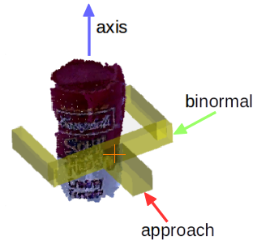

# Grasp Pose Detection (GPD)

Grasp Pose Detection (GPD) is a package to detect 6-DOF grasp poses (3-DOF
position and 3-DOF orientation) for a 2-finger robot hand (e.g., a parallel
jaw gripper) in 3D point clouds. GPD takes a point cloud as input and produces
pose estimates of viable grasps as output. The main strengths of GPD are:

## Requirements

1. [PCL 1.9 or newer](http://pointclouds.org/)
2. [Eigen 3.0 or newer](https://eigen.tuxfamily.org)
3. [OpenCV 3.4 or newer](https://opencv.org)


## Installation

The following instructions have been tested on **Ubuntu 16.04**. Similar
instructions should work for other Linux distributions.

1. Install [PCL](http://pointclouds.org/) and
[Eigen](https://eigen.tuxfamily.org). If you have ROS Indigo or Kinetic
installed, you should be good to go.

2. Install OpenCV 3.4 ([tutorial](https://www.python36.com/how-to-install-opencv340-on-ubuntu1604/)).

3. Clone the repository into some folder:

   ```
   git clone https://github.com/atenpas/gpd
   ```

4. Build the package:

   ```
   cd gpd
   mkdir build && cd build
   cmake ..
   make -j
   ```

You can optionally install GPD with `sudo make install` so that it can be used by other projects as a shared library.

## Parameters

The parameter values in *cfg/eigen_params.cfg* have to be altered according to your requirement. Always build package again after making changes to this file.

Two important parameter to improve number of grasps are:
1. **workspace** - Defines the volume of space in which to search for grasps as a cuboid of dimensions [minX, maxX, minY, maxY, minZ, maxZ], centered at the origin of the point cloud frame. Set it as small as possible
2. **num_samples** - Number of samples that are drawn from the point cloud to
detect grasps. Set it as large as possible.

Other Parameters:
1. **Camera Position** - Modify based on your setup. 
2. **Robot Hand Geometry** - Values depend on Robotic Gripper selection. We have fined set values for the Panda Gripper
3. **Min and Max Aperture** - Gripper width between fingers
4. **Filtering based on approach direction** - Turn on/off and set approach direction based on requirement.

## Grasp Frame

Below is a visualization of the convention that GPD uses for the grasp pose (position and orientation) of a grasp. The grasp position is indicated by the orange cross and the orientation by the colored arrows.



## References

Andreas ten Pas, Marcus Gualtieri, Kate Saenko, and Robert Platt. [**Grasp
Pose Detection in Point Clouds**](http://arxiv.org/abs/1706.09911). The
International Journal of Robotics Research, Vol 36, Issue 13-14, pp. 1455-1473.
October 2017.

